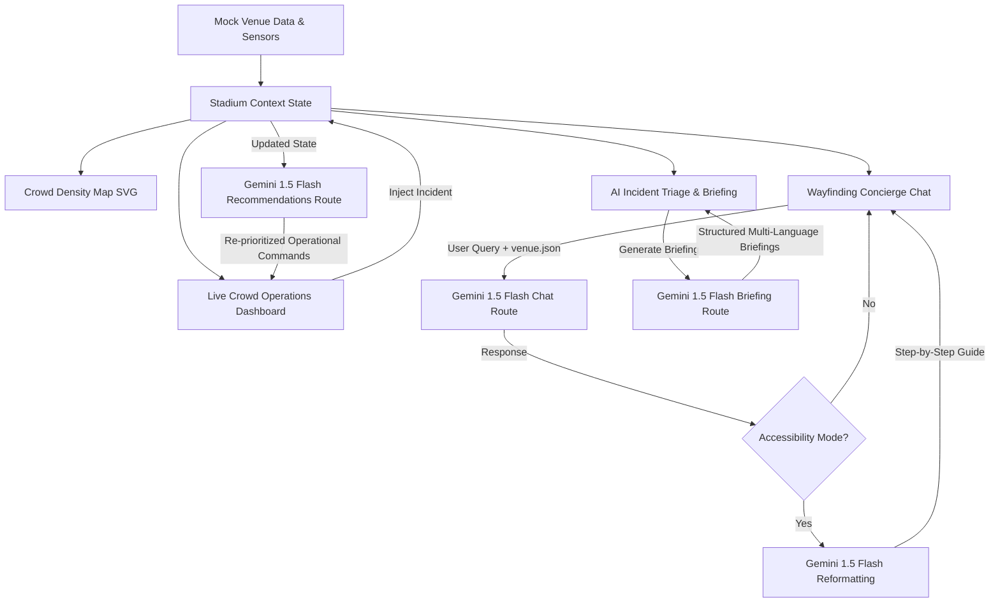

# PITCH — Personalized Intelligent Tournament Companion Hub
### AI Control Layer for FIFA World Cup 2026 Stadium Operations

PITCH is the AI control layer that sits between FIFA World Cup 2026 stadium operations and every human in the building — fans, volunteers, or control-room staff — turning raw, messy, real-time signals into a single conversational and visual interface.

**Live Deployment URL:** [https://pitch-one-opal.vercel.app/](https://pitch-one-opal.vercel.app/)  
**GitHub Repository:** [https://github.com/Saatvik-G/PITCH.git](https://github.com/Saatvik-G/PITCH.git)

---

## 🏟️ Visual Identity & Tone
PITCH breaks away from generic SaaS templates with a dark stadium-night palette (deep green `#0B3D2E`, floodlight white `#F5F7F2`, and accent gold `#D4AF37`), designed to evoke the electric energy of a World Cup night match. 

Typography features a high-density, uppercase sports-broadcast style for headers (Oswald) and a clean sans-serif for body text (Inter). The copy tone is confident, terse, and command-center ready (e.g., *"Gate A — 4 min to seat, low congestion. Elevators at Section 105 active"* instead of polite chatbot filler).

---

## 🛠️ Technology Stack
- **Framework**: Next.js 14/15 (App Router), TypeScript
- **Styling**: Tailwind CSS
- **AI Core**: Gemini API (via `@google/generative-ai` SDK) utilizing the `gemini-3.5-flash` model for high-speed, structured JSON outputs.
- **State Management**: React Context providing ticking stadium occupancy simulation.
- **Icons**: Lucide React

---

## 🏗️ Architecture & Data Flow



---

## 🌟 Flagship Features (Tier 1)

### 1. Multilingual AI Wayfinding & Accessibility Concierge
- **Interface**: Designed like a stadium PA/scoreboard with instant-action prompt chips.
- **Multilingual Support**: Real-time translation between English, Spanish, and French.
- **Accessibility Mode**: Toggling Accessibility Mode executes a **chained second-stage Gemini call** that strips conversational filler and reformats routing directions into plain-language, step-by-step instructions.
- **RAG Grounding**: Responses are grounded in `venue.json` containing gate locations, elevator banks, accessibility services, and concession stand details.

### 2. Live Crowd Intelligence & Ops Dashboard
- **Simulation**: Stadium state updates metrics (gate/section occupancy) in real time.
- **Visuals**: An interactive SVG map color-coded by density (Green <60%, Yellow 60-85%, Red >85%).
- **GenAI recommendations**: Ticking updates or incident injections call Gemini to produce ranked operational commands for the control room (*"Redirect Gate B arrivals to Gate A — 25% under capacity"*).
- **Incident Injection**: Includes preset templates and custom forms to inject incidents (e.g. *Medical Emergency Section 125*) to show real-time command re-ranking in front of judges.

### 3. AI Incident & Briefing Summarizer
- **Raw Feed**: A streaming log of messy radio-call logs, facilities issues, and volunteer text reports.
- **AI Triage**: Groups and translates the chaotic logs into structured briefings categorized into *Top Priorities*, *Resolved*, and *Watch-List*.
- **Multilingual Briefing**: Summarizes the briefing in the volunteer crew's language (English, Spanish, French) on demand.

### 4. Phase 2 Roadmap & Integrations (Tier 2)
- **Transportation Optimization**: Predictive park-and-ride shuttle routing and real-time egress flow integration.
- **Sustainability & Waste Routing**: Automated trash receptacle weight sensor routing for volunteer cleanups during match downtime.

---

## 🚀 Setup & Installation

### Prerequisites
- Node.js (v18.x or later)
- npm (v9.x or later)
- Gemini API Key

### Local Installation
1. Clone the repository:
   ```bash
   git clone https://github.com/Saatvik-G/PITCH.git
   cd PITCH
   ```
2. Install dependencies:
   ```bash
   npm install
   ```
3. Set up environment variables:
   Create a `.env.local` file in the root directory:
   ```env
   GEMINI_API_KEY=your_gemini_api_key_here
   ```
4. Run the development server:
   ```bash
   npm run dev
   ```
5. Open [http://localhost:3000](http://localhost:3000) to view the copilot cockpit.

---

## ☁️ Vercel Deployment Instructions

1. Push the code to your GitHub repository:
   ```bash
   git add .
   git commit -m "feat: complete pitch copilot submission"
   git push origin main
   ```
2. Log in to [Vercel](https://vercel.com) and click **Add New Project**.
3. Import the `PITCH` repository.
4. Expand **Environment Variables** and add:
   - Key: `GEMINI_API_KEY`
   - Value: `your_gemini_api_key_here`
5. Click **Deploy**. Vercel will build and launch your stadium copilot.
